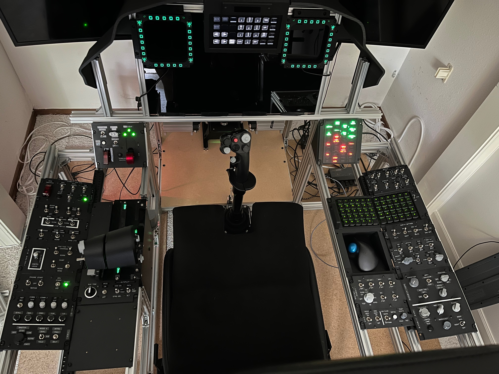
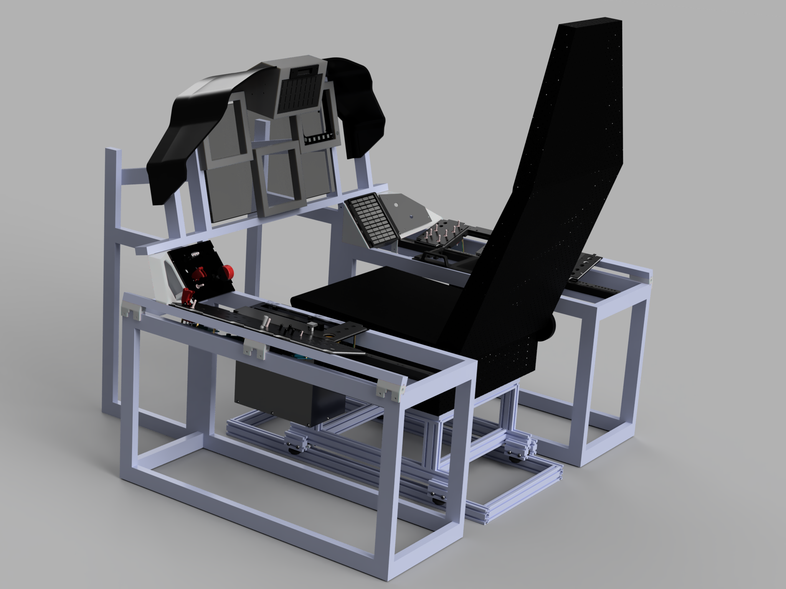
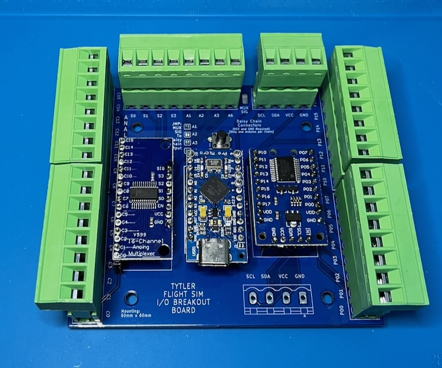
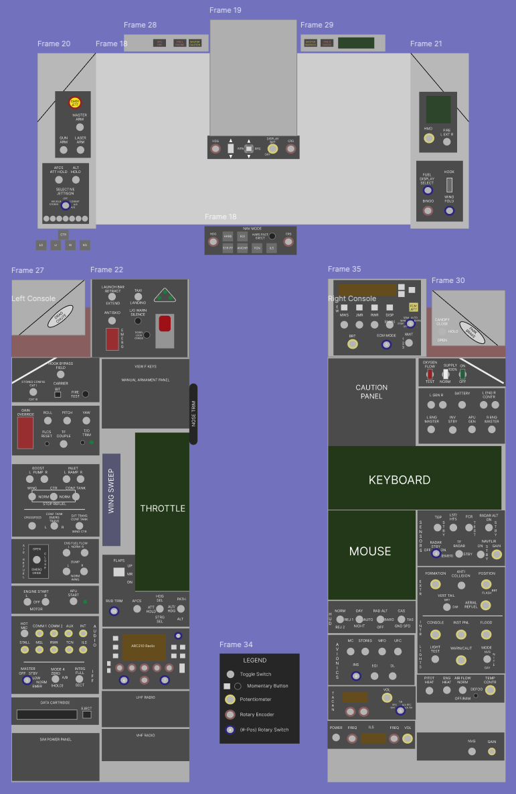

# Flight Sim Cockpit

Repository for Hardware and Embedded Software for flight simulation cockpit and avionics panels that provide input/output for Flight Simulators (DCS).

The cockpit is modeled on a blend of F/A-18C, A-10C, F-15E, and F-16C cockpits.

## Software 

The software directory contains embedded software that runs on Arduino and Raspberry Pi microcontrollers.
These connect to a PC via USB and emulate USB HID joystick devices and also communicate with DCS-BIOS software.

To-do: Develop a Windows PC middleware to connect USB Serial -> Middleware -> DCS-BIOS and avoid flashing DCS module-specific code to the microcontrollers.

## Hardware

(Partially) assembled cockpit.  

### CAD Models

#### [Link to Fusion 360 Web Viewer of CAD Model](https://a360.co/4bIpcXp)
- Frame is built out of 2040 and 2020 aluminum extrusion according to the CAD model.
- Chair frame uses same extrusion and also 3D Printed TPU surrounding bearings for sliding in/out.
- For complex angles (such as left/right console outer rails and corners), extrusion connectors are 3D printed.
- The panels themselves are a mix of 3D prints or acrylic machined with a CNC router.
- Temporary labels are added with a Brother label maker and 6mm white on black tape.
- Permanent labels are made by painting white acrylic panels matte black and laser engraving the text and symbols.
- Glare shield is designed in multiple parts to enable printing on a 256x256 3D printer bed.
  

### PCBs

Current version of PCBs using:
 - Arduino Micro Pro (Atmel ATmega32U4)
    - Central processor for all I/O
    - Emulates a USB HID Joystick device
    - Communicates over Serial to PC middleware
    - Likely will upgrade to RP2040 Pico boards in next revision
 - PCF8575 I2C Expanders
    - Provides 16 digital I/O pins per board
    - Inputs used for Switches, Outputs used for indication LEDs
 - CD74HC4067 Multiplexers
    - Provides 16 to 1 analog input multiplexing
    - Used for reading analog potentiometers
 - RP2040 Raspberry Pi Pico (external of PCB)
    - Used for reading rotary encoders
    - Uses PIO to provide parallel handling of encoder interrupts
 - Screw Terminal breakouts

### Cockpit Layout

The layout of avionics panels is a combination of functions from multiple aircraft, so some panels are replicas of specific aircraft, where others are a mix of multiple or have labels renamed to more generic functionality.

#### [Link to Cockpit Layout comparison to Real Aircraft layouts [Figma document]](https://www.figma.com/design/4pN5J7COTx5o1YJxnx6NWO/Layout-Diagram?node-id=0-1&t=OCtYUoI0DKsqzIj2-1)

