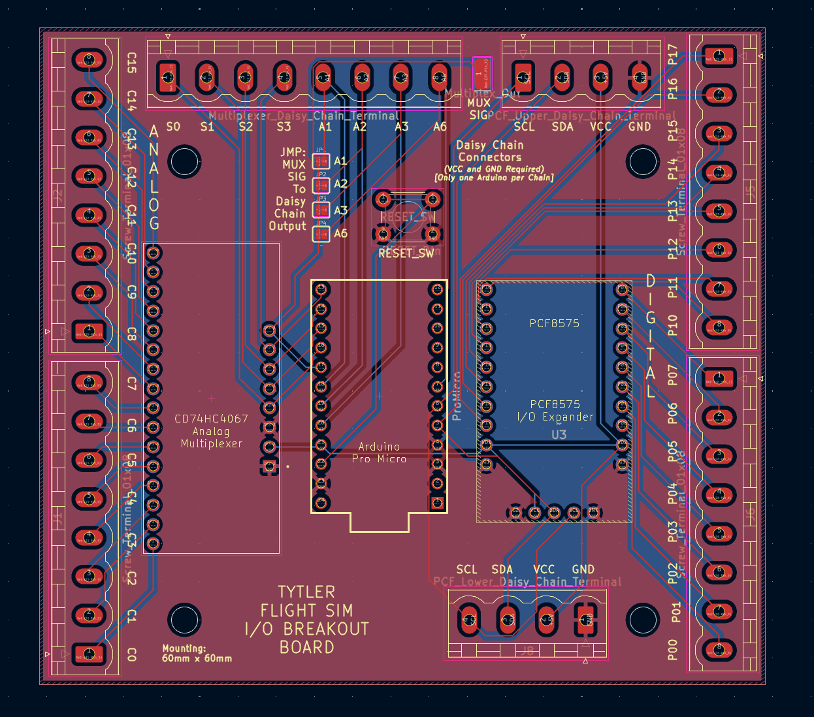

# Flight Sim Breakout Board

Arduino Library for the Flight Sim Breakout Board

Allows for multiple Digital I/O Expanders (PCF8575) and Analog I/O Muxes (CD74HC4067) to be used when Daisy Chained to the board.

